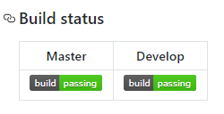
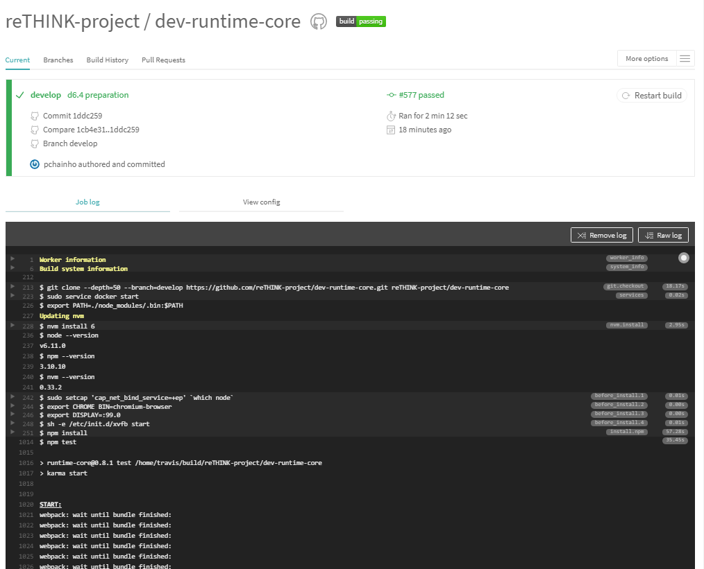

## Runtime evaluation

### Description of Component

The Hyperty Runtime supports the execution of Hyperties including:
•	Deployment of Hyperties
•	Deployment of Protocol Stubs
•	Communication between Hyperties
•	Management of Identities associated to Hyperties

###	Metrics

Device side Hyperty Runtime (browser and standalone runtime) as well as Server side Runtime (NodeJS runtime) were implemented based on common runtime core platform.

#### Functional Metrics

More than 150 functional metrics are defined to evaluate the Hyperty Runtime including:

Hyperty is correctly deployed in the Runtime:

*	Address Allocation
*	Registration in the Domain Registry
*	Associated with user Identity

Protostub is correctly deployed in the Runtime:

*	Address Allocation
*	Connected to the Message Node

Idp Proxy is correctly deployed in the Runtime:

*	Address Allocation
*	Connected to the IDP

Messages are correctly delivered by the Runtime:

*	Among Hyperties in the same runtime (intra-runtime)
*	Among Hyperties in different runtimes, from the same domain (intra-domain)
*	Among Hyperties in different runtimes, from different domains (inter-domain)

Identity Management:

*	User is able to select IDP to be used independently of the Hyperty
*	User is able to login with selected IDP
*	Identity Assertions are correctly generated and added to the body of outgoing Messages
*	Identity Assertions contained in the body of incoming messages are correctly validated by the IDP
* Communication between two hyperties is encrypted with tokens generated from the IdP Proxies.

Data Synchronisation:

* Reporter creates a new object and invites one or more Observers
* Observer subscribes an existing object
* The object handled by the Observer is synchronised with the changes performed by the Reporter

Address reusage and data objects resume:

* Address allocated to hyperty is reused between sessions
* Address allocated to data objects are reused between sessions
* Data Objects created by Reporters are resumed between sessions
* Data Objects subscribed by Observers are resumed between sessions

#### Non-Functional Metrics

For the Core runtime, the execution time is the only non-functional metric used. For the NodeJS runtime, since it can be used in a server, additional non-functional metrics are defined:

**Deployment Performance**

1. Number of Hyperties deployed / sec
1. Number of Protostubs deployed / sec

**Reporte-Observer data synchronisation performance**

1. Number of Data Objects created / sec
1. Number of Data Objects created / sec with data object children
1. Number of Data Objects subscribed / sec
1. Number of Data Objects subscribed / sec with data object children
1. Number of Subscribers per Data Object
1. Number of Subscribers per Data Object with data object children
1. Number of Data Objects changed / sec with different number of subscribers and size of the change
1. Number of Data Objects Childs created / sec with different number of subscribers and size of the data
1. Number of Reporter data objects resumed / sec
1. Number of Reporter parent data objects resumed / sec with different numbers of data object childs
1. Number of Observer data objects resumed / sec
1. Number of Observer parent data objects resumed / sec with different numbers of data object childs

###	Functional Runtime Tests

The evaluation of the Hyperty Runtime is performed with Karma Unit tests implemented [here](https://github.com/reTHINK-project/dev-runtime-core/tree/master/test), and for each one the execution time was measured as defined above. For quality control purposes, these tests are automatically executed every time a `git push` or `git pull request` is performed to develop and master branch and its status is depicted following best Continuous Delivery practices. The quality status is depicted in the Github repository *readme* page:

The most updated full detailed report of the tests execution are provided at https://travis-ci.org/reTHINK-project/dev-runtime-core where we can continuously monitor the runtime quality including:

* Hyperties are correctly deployed in the Runtime including the allocation of addresses, the registration in the Domain Registry and the association of User Identities;
* Protostubs are correctly deployed in the Runtime including Protocol Stub is successfully retrieved from the Catalogue server, an Hyperty Runtime URL is successfully allocated to the Protocol Stub, and the Protocol Stub is instantiated and connected to the Message Node.
* Idp Proxy is correctly deployed in the Runtime that is used to authenticate user with  selected IdP e.g. Google IdP. The IDP Proxy is successfully retrieved from the Catalogue server, an Hyperty Runtime URL is successfully allocated to the IDP Proxy, and the IDP Proxy is instantiated and successfully connected to Google IDP.
* Messages are correctly delivered by the Runtime including:
 * messages were successfully exchanged among Hyperties running in different runtimes, from the same domain (intra-domain).
 * messages were successfully exchanged among two Hyperties running in different runtimes, from different domains (inter-domain).
* User is able to select IDP to be used independently of the Hyperty
* The user successfully authenticates with selected IdP.
* Identity Assertions are correctly generated and added to the body of outgoing Messages
* Identity Assertions contained in the body of incoming messages are correctly validated by the IDP

###	Non-Functional Runtime Tests

The following execution time measurements were taken:

| Test | Execution Time (ms) |
| :--------------------------------------: | :--------------------------------------: |
| Runtime installation   |                 36                 |
| Protostub deployment   |                 10                 |
| Idp Proxy deployment   |                 6                 |
| New Hypert Address Allocation   |                 3                 |
| Hypert Address Reusage   |                 2                 |
| Intra-runtime Hyperty Message Delivery  |                 4                 |
| Inter-runtime Hyperty Message Delivery  |                 5                 |
| Inter-domain Hyperty Message Delivery  |                 NA                 |
| New Data Object Address Allocation   |                 1                 |
| Data Object Address Reusage   |                 1                 |
| Data Object creation (new Reporter)   |                 27                 |
| Data Object subscription (new Observer)  |                 42                 |
| Data Object Observer Resume   |                 34                 |
| Data Object Reporter Resume   |                 20                 |
| Data Object Update synchronised with Observer   |                 13                 |

Additional non-functional evaluations are provided for:

* Identity Module (see [here](identity-module/IdMEvaluation.md))
* Policy Engine (see [here](policy-engine/README.md))

### Evaluation analysis

*to be provided*
