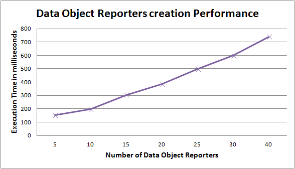
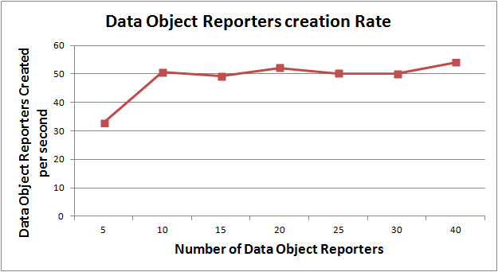
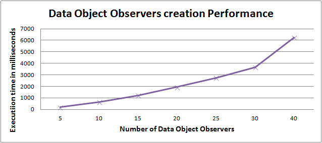
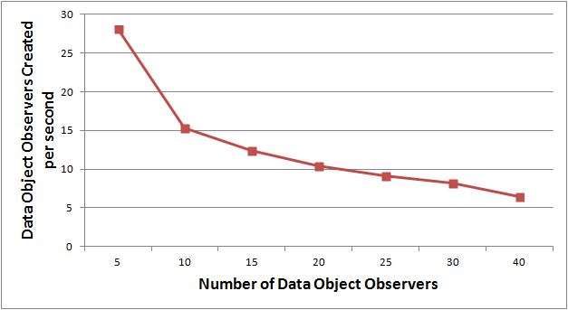
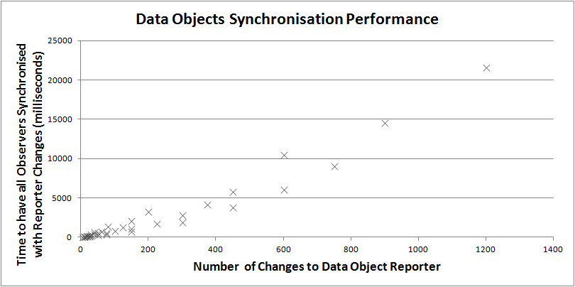
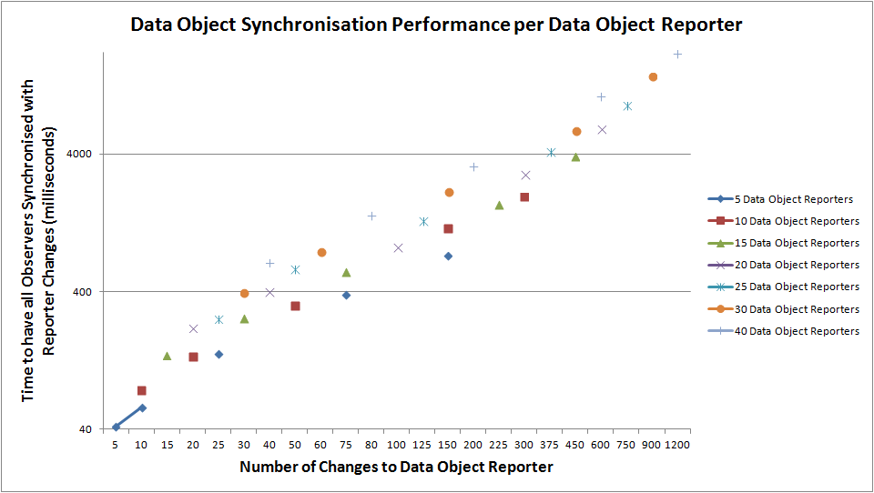

## Runtime evaluation

### Description of Component

The Hyperty Runtime supports the execution of Hyperties including:
•	Deployment of Hyperties
•	Deployment of Protocol Stubs
•	Communication between Hyperties
•	Management of Identities associated to Hyperties

###	Metrics

Device side Hyperty Runtime (browser and standalone runtime) as well as Server side Runtime (NodeJS runtime) were implemented based on common runtime core platform.

#### Functional Metrics

More than 150 functional metrics are defined to evaluate the Hyperty Runtime including:

Hyperty is correctly deployed in the Runtime:

*	Address Allocation
*	Registration in the Domain Registry
*	Associated with user Identity

Protostub is correctly deployed in the Runtime:

*	Address Allocation
*	Connected to the Message Node

Idp Proxy is correctly deployed in the Runtime:

*	Address Allocation
*	Connected to the IDP

Messages are correctly delivered by the Runtime:

*	Among Hyperties in the same runtime (intra-runtime)
*	Among Hyperties in different runtimes, from the same domain (intra-domain)
*	Among Hyperties in different runtimes, from different domains (inter-domain)

Identity Management:

*	User is able to select IDP to be used independently of the Hyperty
*	User is able to login with selected IDP
*	Identity Assertions are correctly generated and added to the body of outgoing Messages
*	Identity Assertions contained in the body of incoming messages are correctly validated by the IDP
* Communication between two hyperties is encrypted with tokens generated from the IdP Proxies.

Data Synchronisation:

* Reporter creates a new object and invites one or more Observers
* Observer subscribes an existing object
* The object handled by the Observer is synchronised with the changes performed by the Reporter

Address reusage and data objects resume:

* Address allocated to hyperty is reused between sessions
* Address allocated to data objects are reused between sessions
* Data Objects created by Reporters are resumed between sessions
* Data Objects subscribed by Observers are resumed between sessions

#### Non-Functional Metrics

For the Core runtime and the Browser Runtime, the execution time is the only non-functional metric used. For the NodeJS runtime, since it can be used in a server, additional non-functional metrics are defined:

**Deployment Performance**

1. Number of Hyperties deployed / sec
1. Number of Protostubs deployed / sec

**Reporte-Observer data synchronisation performance**

1. Number of Data Objects created / sec
1. Number of Data Objects created / sec with data object children
1. Number of Data Objects subscribed / sec
1. Number of Data Objects subscribed / sec with data object children
1. Number of Subscribers per Data Object
1. Number of Subscribers per Data Object with data object children
1. Number of Data Objects changed / sec with different number of subscribers and size of the change
1. Number of Data Objects Childs created / sec with different number of subscribers and size of the data
1. Number of Reporter data objects resumed / sec
1. Number of Reporter parent data objects resumed / sec with different numbers of data object childs
1. Number of Observer data objects resumed / sec
1. Number of Observer parent data objects resumed / sec with different numbers of data object childs

###	Functional Runtime Tests

The evaluation of the Hyperty Runtime is performed with Karma Unit tests implemented [here](https://github.com/reTHINK-project/dev-runtime-core/tree/master/test), and for each one the execution time was measured as defined above. For quality control purposes, these tests are automatically executed every time a `git push` or `git pull request` is performed to develop and master branch and its status is depicted following best Continuous Delivery practices. The quality status is depicted in the Github repository *readme* page:

The most updated full detailed report of the tests execution are provided at https://travis-ci.org/reTHINK-project/dev-runtime-core where we can continuously monitor the runtime quality including:

* Hyperties are correctly deployed in the Runtime including the allocation of addresses, the registration in the Domain Registry and the association of User Identities;
* Protostubs are correctly deployed in the Runtime including Protocol Stub is successfully retrieved from the Catalogue server, an Hyperty Runtime URL is successfully allocated to the Protocol Stub, and the Protocol Stub is instantiated and connected to the Message Node.
* Idp Proxy is correctly deployed in the Runtime that is used to authenticate user with  selected IdP e.g. Google IdP. The IDP Proxy is successfully retrieved from the Catalogue server, an Hyperty Runtime URL is successfully allocated to the IDP Proxy, and the IDP Proxy is instantiated and successfully connected to Google IDP.
* Messages are correctly delivered by the Runtime including:
 * messages were successfully exchanged among Hyperties running in different runtimes, from the same domain (intra-domain).
 * messages were successfully exchanged among two Hyperties running in different runtimes, from different domains (inter-domain).
* User is able to select IDP to be used independently of the Hyperty
* The user successfully authenticates with selected IdP.
* Identity Assertions are correctly generated and added to the body of outgoing Messages
* Identity Assertions contained in the body of incoming messages are correctly validated by the IDP

###	Non-Functional Runtime Tests

**Runtime Core Performance**

The Core Runtime non-functional tests were performed with a local Catalogue and remote Message Node (Vertx server implementation) and Registry Domain servers hosted at the Hysmart testbed.

The used machine has the following characteristics:

* Intel Core i5-3210 CPU @ 2.6 GHz
* 8 GB RAM
* SSD
* OS: Windows 8.1

The Core Runtime was evaluated in two versions:

* in the normal minified version including all implemented components with 1.315KB size;
* in the light version where the Graph Connector was removed with 500KB size;

The following execution time measurements were taken (Average values):

| **Test**                                 | **Runtime Execution Time (ms)**          | **Runtime Light Execution Time (ms)** |
| :--------------------------------------: | :--------------------------------------: | :--------------------------------------: |
| Runtime installation                     |                 52                 |                39                 |
| Protostub deployment                     |                 23                 |                18                 |
| Idp Proxy deployment                     |                 9                |                 8                 |
| Intra-runtime Hyperty Message Delivery   |                 6                 |                 5                 |
| Inter-runtime Hyperty Message Delivery   |                 6                 |                 6                 |
| New Hypert Address Allocation            |                 4                 |                 4                 |
| Hypert Address Reusage                   |                 2                 |                 2                 |
| New Data Object Address Allocation       |                 1                 |                 1                 |
| Data Object Address Reusage              |                 1                 |                 1                 |
| Data Object creation (new Reporter)      |                 28                 |                 28                 |
| Data Object subscription (new Observer)  |                 61                 |                 63                 |
| Data Object Update synchronised with Observer   |                 16                 |                 16                 |
| Data Object Observer Resume              |                 31                 |                 31                 |
| Data Object Reporter Resume              |                 28                 |                 28                 |
| :--------------------------------------: | :--------------------------------------: | :--------------------------------------: |

**Hyperty Deployment on Browser and NodeJS Runtime implementations**

The Hyperty deployment was tested on the Browser Runtime and NodeJS Runtime implementations in the same machine as described above but now having the Message Node (Vertx implementation) and the Domain Registry running locally.

| **Test**                                 | **Execution Time at Browser Runtime(ms)**          | **Execution Time at NodeJS Runtime(ms)** |
| :--------------------------------------: | :--------------------------------------: | :--------------------------------------: |
| Hyperty Deployment                     |                805                 |               1782                  |
| :--------------------------------------: | :--------------------------------------: | :--------------------------------------: |

As we can see, the NodeJS takes twice the time to deploy an Hyperty when compared with the Browser runtime. It should be noted that the Hyperty deployment implies a few transactions with the Message Node (Address Allocation and Routing Path set for its address) as well as with the Domain Registry (registration entry creation).

#### NodeJS Load Performance

The NodeJS non-functional tests were performed with all functionalities deployed locally in a single machine, including the Catalogue, the Message Node (Vertx server implementation), the Registry Domain and the NodeJS runtime itself.

The used machine has the following characteristics:

* Intel Core i7 with hyper treading
* 8 GB RAM
* SSD
* OS: Ubuntu 14.04

**Data Object Reporters creation Performance**

The purpose of this test is to assess the behavior of the NodeJS runtime with an increasing number of Data Object Reporters, which also includes all transactions required to allocate data object addresses and its registration in the Domain Registry.

As shown in the figure below, the data object creation rate is almost linear and aligned with runtime core tests (a bit better which can be justified by the different machines used).

**Data Object Observers creation Performance**

The purpose of this test is to assess the behavior of the NodeJS runtime with an increasing number of Data Object Observers, which also includes all transactions required to setup the data synchronisation stream and to get authorisation from the Reporter Hyperty.

 The Observer creation takes much longer (around 100% worst) when compared with the Reporter creation performance, whicj is aligned with the Runtime Core tests results. In the figure below we can also see a degradation of the performance when we increase the creation rate of Data Object Observers. This probably means there is some implementation bug not noticed so far.

**Data Object Synchronization Performance**

The purpose of this test is to evaluate how the NodeJS runtime handles the synchronization of an increasing number of changes on Data Objects.

In general, the synchronisation process seems to be well performed and aligned with the Data Object synchronisation tests performed for the Runtime Core (around 10ms) with some degradation with the increasing rate of the Data Object changes. Having a deeper look on the results (see figure below) we can see that increasing the number of Data Objects to be synchronised decreases the performance of the synchronisation process which should be further tested in future.

#### Identity Module and Policy Engine Performance

Additional non-functional evaluations are provided for:

* Identity Module (see [here](identity-module/IdMEvaluation.md))
* Policy Engine (see [here](policy-engine/README.md))

### Evaluation analysis

The results obtained for the runtime core evaluation shows in general, good results. We can conclude that the overhead introduced by the messaging framework (the message bus components) and by the security components (policy engine and identity module) is marginal (always under 10 ms) and does compensate the benefits gained by the security by design approach. The execution time for the dynamic deployment of Protostubs and IdP Proxies is also very small (8 to 23 ms) and does not hurt the user experience. It means the network download time from the Catalogue is the one that may impact the user experience and the storage of these components by the Runtime Catalogue has significantly increase the Runtime performance. The Runtime installation execution time is better than expected (around 50 ms ) and we have noticed that there is a non-linear correlation with the size of the runtime execution file (around 25 percent of improvement when comparing the normal runtime installation time with the light runtime installation time). Since the file size has a higher impact on the download time from the Catalogue, we can conclude that the reduction of the runtime components size, notably of the Graph Connector, is one important aspect to be improved in future.
The execution time for the data synchronization is approximately 50% of the full process, taking into account the message delivery time is around 8ms (see inter-runtime message delivery test), which we consider an acceptable cost to be paid to benefit from having seamless interoperability among peers without having to standardize protocols or APIs.
Data Synchronisation rate with NodeJS Runtime is in aligned with these results but some improvement should be considered to improve the performance when the data changes rate is increased.

As expected, the Data Object creation execution time (Reporter and Observer) is where most of the data synchronisation cost is. The obtained results are considered very good for the browser runtime where high rates of data object creations are not expected (edge computing benefit). However, these results are not so good for the NodeJS runtime taking into account that it should be used at the back-end with higher rate of data objects creation. Furthermore, the data object subscription execution is much higher than the data object creation time (around 100 percent higher) and the performance becomes worst when the creation rate of Data Object Observers is increased. As already mentioned above, this probably means there is some implementation bug not noticed so far that has to be carefully investigated. At the end, we also conclude that the Data Object creation process should be further simplified, notably for Server side hyperties by, for example, giving the option not to register Data Objects like - WebRTC Connection Data Objects - to Domain Registry. Finally, should be noted that having the option to resume data objects between sessions will also dramatically reduce the impact of the Data Object creation high cost. For example, WebRTC Connection data objects would only be created for communication between new users.
